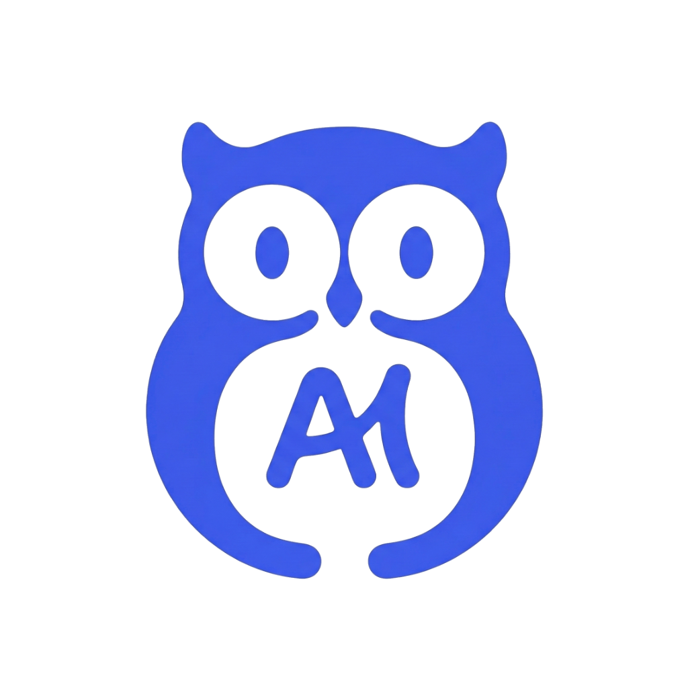
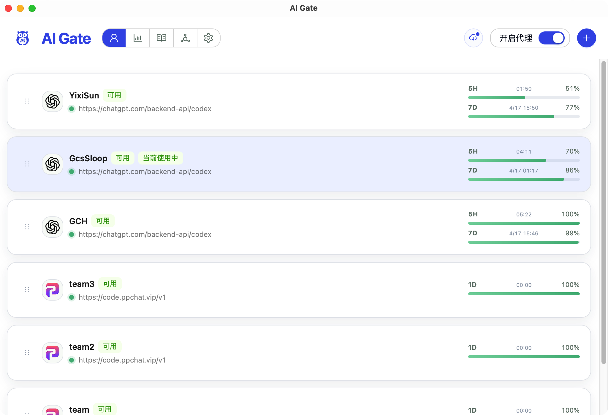
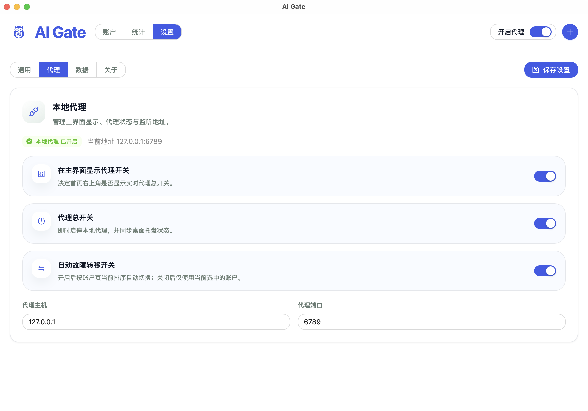
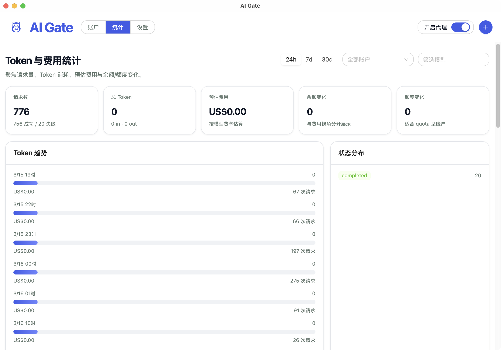
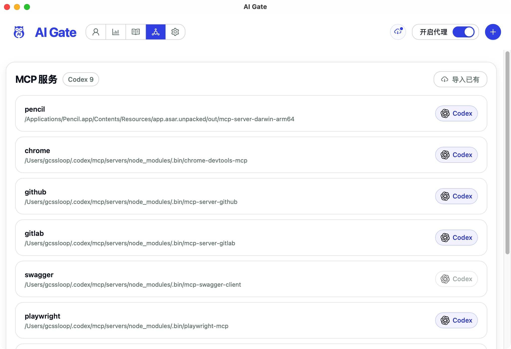
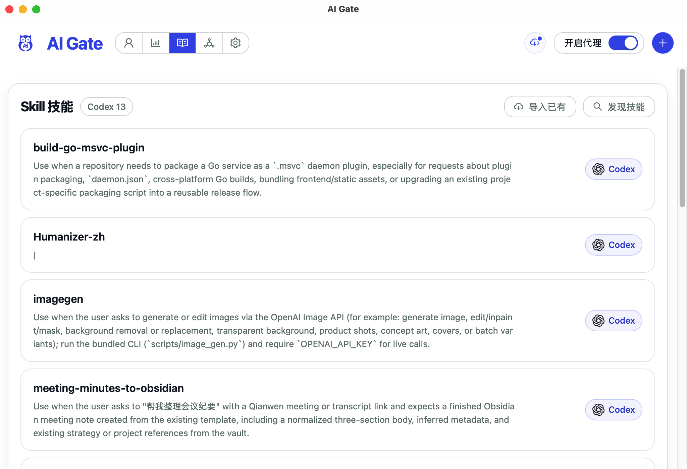
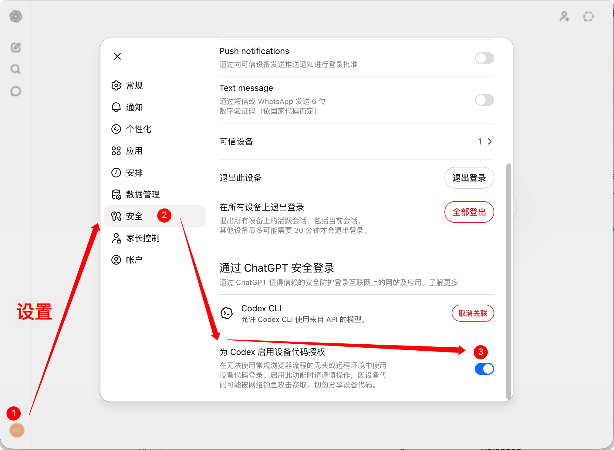
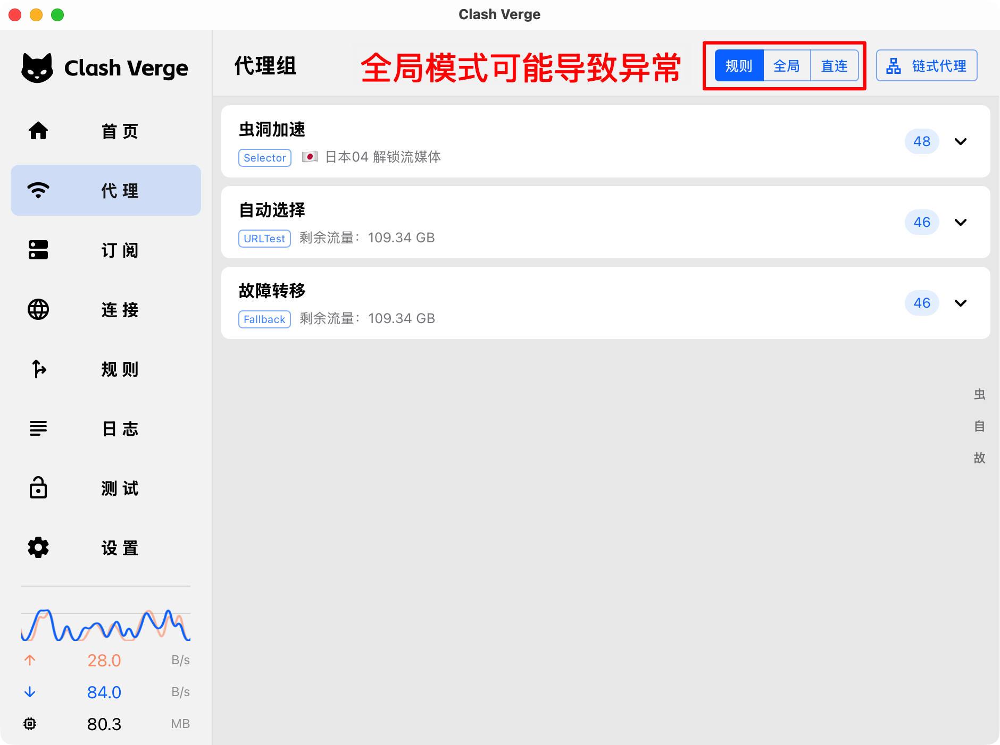
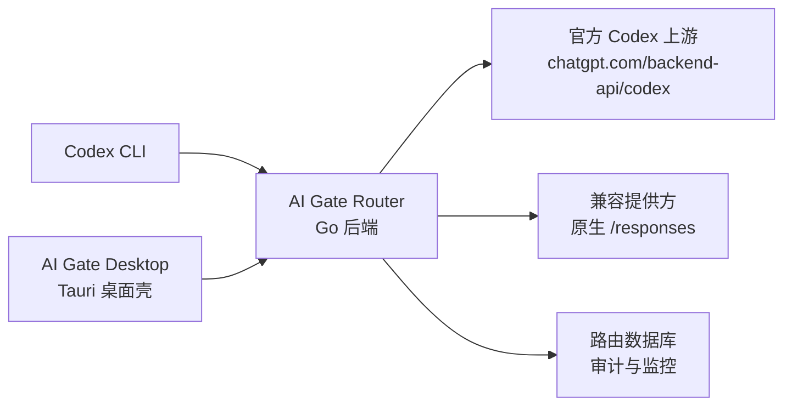
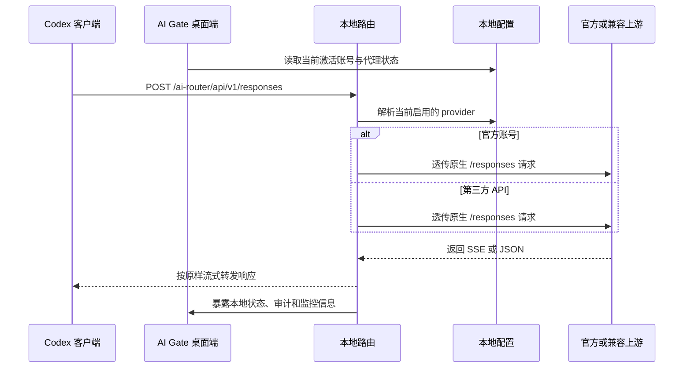

# AI Gate

简体中文 | [English](docs/README.en.md)

<p align="center">
  
</p>

<p align="center">
  <strong>为 Codex 工作流设计的本地优先入口层：统一多账号、不中断切换、少折腾配置。</strong>
</p>

<p align="center">
  
  
  
  
  
  
</p>

AI Gate 不是另一个 AI 模型，也不是云端代理平台。它是在 AI 之上加的一层轻量级本地网关和桌面壳，解决真实使用里最烦的几件事：多个官方账户和第三方账户怎么统一管理，额度耗尽时怎么不中断切换，代理、Skill、MCP、统计和备份怎么收敛到一个入口，而且账号信息和 Key 仍然留在本机。

## 为什么是 AI Gate

很多人开始高频使用 Codex 之后，真正卡住的已经不是模型本身，而是工作流：

- 一个官方账户不够用，多号切换很烦
- 第三方 API 能补额度，但和官方混用时配置容易乱
- 正在对话中途，当前账户额度耗尽或临时异常，流程直接断掉
- Skill、MCP、统计、代理开关、备份恢复散落在不同位置，维护成本高
- 想省事，但又不想把账号和 Key 交给远端服务

AI Gate 的目标很简单：把这些问题收成一个本地优先、边界清晰、足够稳定的入口层。

## 核心亮点

### 1. 多账号统一接入

- 同时管理多个官方账户和第三方账户
- 保留一个稳定的本地入口，不用反复修改客户端配置
- 桌面端直接导入、切换、查看状态，降低日常运维成本

### 2. 对话不中断切换

- 当前账户额度耗尽、异常或暂时不可用时，自动切到下一个可用账户
- 切换尽量发生在对话内部，不要求用户手动重开一轮流程
- 支持锁定账户，锁定后不会被自动路由选中，但仍可手动切换使用
- 更适合长任务、连续调试和高频编码场景

### 3. 本地优先更安心

- 后端只监听 loopback，桌面端只拉起本地 sidecar
- 账户信息、Key、配置补丁、备份快照都保留在本机
- 开源可审查，不需要把信任建立在黑盒服务上

### 4. Skill 与 MCP 管理

- 在桌面端统一管理 Skill 和 MCP 相关配置
- 更容易把本地工具链、知识库和工作流接到 Codex 上
- 适合把 Obsidian、脚本工具和自定义能力纳入同一个入口

### 5. 可观测与低折腾

- 提供代理、统计、备份恢复和菜单栏控制
- 既保留工程可控性，也尽量降低普通用户的使用门槛
- 目标不是“功能越多越好”，而是“每天能稳定用下去”

## 适合谁用

- 有多个官方账户，想统一管理的人
- 官方账户和第三方 API 混着用的人
- 不希望频繁手改 `~/.codex/config.toml` 的人
- 想把 Skill、MCP、统计和代理入口收进一个桌面端的人
- 重视本地安全边界，不想把账号信息交给远端中转的人

## 产品巡览

### 首页总览



### 代理配置



### 统计页



### MCP 管理



### Skill 管理



## 3 分钟上手

### 普通用户

1. 从 [最新版本](https://github.com/GcsSloop/ai-gate/releases/latest) 下载桌面客户端
2. 导入当前官方账户，或添加第三方 API 账户
3. 打开代理，开始在 Codex 里使用
4. 如果当前账户用量耗尽，AI Gate 会尽量自动切到下一个未锁定的可用账户

### 开发者

```bash
cp .env.example .env
make backend
make frontend
npm --prefix desktop install
npm --prefix desktop run dev
```

前端开发服务器会将本地 API 请求代理到 `http://127.0.0.1:6789`。

## 常见问题 Q&A

### **Q: 设备码无法登录怎么办？**

优先检查 AI Gate 是否已经开启设备登录配置。如果没有开启，Codex 仍会走原有登录路径，设备码登录可能无法通过 AI Gate 正常接入。



-----

### **Q: 遇到无法访问或请求报错怎么办？**

先检查代理模式和上游地址是否正确。使用 Clash 等代理工具时，建议优先使用规则模式；全局模式可能让本地路由、上游访问或回环地址解析出现异常。



如果代理模式和上游地址看起来都正常，再通过网页直接测试上游路由是否通畅，确认问题发生在上游、代理链路还是 AI Gate 本地入口。

-----

### **Q: 开启代理后对话记录丢失怎么办？**

复制下面内容，粘贴到 Codex 中执行会话记录迁移：

```text
请下载并使用 AI Gate 的 migrating-codex-history Skill，帮我把本机 Codex 会话记录迁移到 AI Gate 使用的 provider 下。

Skill 地址：
https://raw.githubusercontent.com/GcsSloop/ai-gate/main/skills/migrating-codex-history/SKILL.md

执行要求：
1. 先读取这个 Skill，并严格按照 Skill 里的 Workflow 操作。
2. 如果当前目录存在 AI Gate 仓库，优先使用仓库内的 scripts/migrate_openai_history_to_aigate.sh。
3. 如果当前目录没有 AI Gate 仓库，请按 Skill 说明下载迁移脚本到临时文件，不要使用 curl | bash。
4. 先执行 dry-run，并把迁移摘要展示给我确认。
5. 确认后再执行真实迁移。
6. 迁移完成后告诉我实际执行的命令，以及 summary 里的 copied、patched_existing、patched_db、patched_index 数量。
```

## 架构与安全边界



### 请求流转



### 边界说明

- **仅本地运行**：后端只监听回环地址，桌面应用只启动本地 sidecar
- **薄网关优先**：`response_id`、`previous_response_id`、状态码和 SSE 生命周期全部以上游为准
- **不做伪实现**：做不到就显式删除，不用“看起来像支持”来掩盖语义缺失
- **本地优先**：桌面端管理的状态和备份快照位于 `~/.aigate/data`
- **配置补丁可恢复**：只有在开启代理、关闭代理或执行恢复时，AI Gate 才会修改 `~/.codex/config.toml` 和 `~/.codex/auth.json`

更完整的边界说明见 [thin-gateway-mode.md](docs/thin-gateway-mode.md)。

## Codex、Skill 与 MCP 如何协作

### Codex CLI

推荐本地配置如下：

```toml
model_provider = "router"

[model_providers.router]
name = "router"
base_url = "http://127.0.0.1:6789/ai-router/api"
wire_api = "responses"
requires_openai_auth = true
```

当前网关协议面：

- `POST /ai-router/api/v1/responses`
- `GET /ai-router/api/v1/models`

### Skill 工作流

- AI Gate 不替代 Skill，而是给 Skill 提供一个更稳定的本地入口
- 可以继续使用仓库内 Skill 或自定义 Skill，把会话迁移、本地脚本、知识整理等能力接入 Codex
- 会话迁移 Skill 见 [skills/migrating-codex-history/SKILL.md](skills/migrating-codex-history/SKILL.md)

### MCP 工作流

- MCP 配置可以和账户、代理一起放在桌面端统一管理
- 更适合需要接本地知识库、脚本服务或工具服务的工作流
- 对于频繁使用 MCP 的用户，统一入口比手工维护多个配置更稳

## 当前能力

- 通过本地网关暴露 `POST /responses` 与 `GET /models`
- 支持官方账号认证与 token 刷新
- 支持原生实现 `/responses` 的第三方提供方
- 提供 React 前端与 Tauri 桌面外壳
- 保留本地审计数据与运行观测数据
- 提供 Skill、MCP、统计、代理和备份恢复入口

## 明确不支持的能力

- 从 `/responses` 回退到 `/chat/completions`
- 在本地生成 `response_id`
- 用本地历史重建 `previous_response_id`
- 模拟响应检索类接口
- 作为公网托管网关或 SaaS 服务直接部署

## 本地开发

### 准备环境变量

```bash
cp .env.example .env
```

修改 `.env`，至少替换 `CODEX_ROUTER_ENCRYPTION_KEY`，不要继续使用示例值。

默认本地配置如下：

```env
CODEX_ROUTER_LISTEN_ADDR=127.0.0.1:6789
CODEX_ROUTER_DATABASE_PATH=data/codex-router.sqlite
CODEX_ROUTER_SCHEDULER_INTERVAL=5m
CODEX_ROUTER_ENCRYPTION_KEY=change-this-to-a-random-32-plus-char-secret
```

### 常用命令

```bash
make backend
make frontend
make test
```

当前会执行：

- `cd backend && go test ./...`
- `npm --prefix frontend run test`

### 可选第三方冒烟测试

```bash
THIRD_PARTY_BASE_URL=https://code.ppchat.vip/v1 \
THIRD_PARTY_API_KEY=sk-... \
make smoke-third-party
```

这个测试只适用于原生支持 `/responses` 的上游。

## 桌面打包

本地 macOS 打包流程：

```bash
npm --prefix frontend ci
npm --prefix desktop install
bash scripts/desktop/build_sidecar_macos.sh
npm --prefix desktop run tauri build -- --target universal-apple-darwin
bash scripts/desktop/notarize_macos.sh
bash scripts/desktop/collect_release_assets.sh
```

产物会出现在 `release-assets/`：

- `aigate-<tag>-macOS.dmg`
- `aigate-<tag>-macOS.zip`
- `aigate-<tag>-darwin-universal.app.tar.gz`
