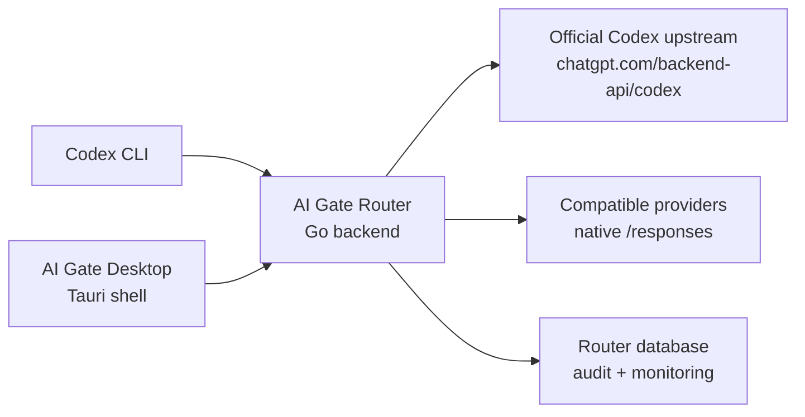
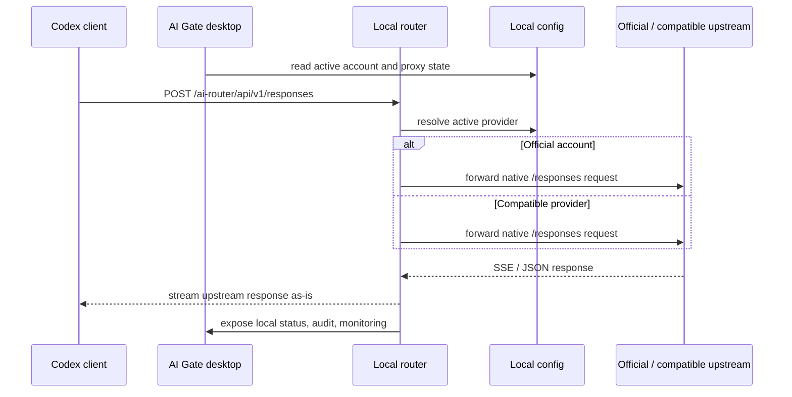

# AI Gate

[简体中文](../README.md) | English

<p align="center">
  
</p>

<p align="center">
  <strong>A local-first Codex gateway for account switching, thin routing, and desktop control.</strong>
</p>

<p align="center">
  
  
  
  
  
</p>

AI Gate is a local gateway and desktop shell for Codex-style workflows. It focuses on a narrow, explicit contract:

- switch between official and compatible accounts locally
- route requests to native upstream `/responses` APIs
- preserve upstream response semantics instead of re-implementing them
- provide lightweight local observability and desktop controls

This repository is intentionally **not** a cloud deployment stack and **not** a protocol emulation layer.

## Why This Project Exists

Codex users often need a stable local entry point for:

- switching between multiple authenticated accounts
- routing requests without changing client behavior
- observing usage and health locally
- packaging the experience into a desktop app for non-terminal workflows

AI Gate solves that by staying thin. It does not synthesize response state, fake retrieval endpoints, or reconstruct multi-turn semantics locally.

## Core Principles

- **Local only**: backend binds to loopback only and the desktop bundle starts the sidecar locally.
- **Thin gateway**: upstream owns `response_id`, `previous_response_id`, status codes, and SSE lifecycle.
- **No protocol cosplay**: unsupported semantics are removed instead of being faked.
- **Operational clarity**: account switching, audit data, and monitoring stay visible locally.

## Architecture



### Request Flow



### Component Responsibilities

- **Codex client**: keeps the normal client workflow and points to one stable local gateway entry.
- **AI Gate desktop**: manages accounts, proxy state, backups, restore flows, and local operator controls.
- **AI Gate router**: resolves the active account, forwards native `/responses` traffic, and keeps local audit and monitoring records.
- **Official / compatible upstreams**: remain authoritative for `response_id`, `previous_response_id`, tool-call semantics, and streaming lifecycle.

### Data And Safety Boundary

- AI Gate stays local-first: the router binds to loopback and the desktop app launches only a local sidecar.
- Desktop-managed state and backup snapshots live under `~/.aigate/data`.
- Codex client configuration remains in `~/.codex/config.toml` and `~/.codex/auth.json`; AI Gate only patches these files when proxy or restore operations require it.
- The router database path is still configurable through `CODEX_ROUTER_DATABASE_PATH`, so audit and monitoring storage can stay local without being hard-coded into one deployment shape.
- Unsupported upstream behavior is removed instead of emulated, which keeps request semantics closer to official Codex behavior.

## Screenshots

### Main Dashboard


### Proxy Settings


## What It Does

- Routes `POST /responses` and `GET /models` through a local gateway endpoint.
- Supports official account auth flows and token refresh.
- Supports third-party providers only when they natively implement `/responses`.
- Exposes a React frontend and Tauri desktop shell for local control.
- Stores local audit and monitoring data for observability.

## What It Explicitly Does Not Do

- Fall back from `/responses` to `/chat/completions`
- Generate local `response_id`
- Rebuild `previous_response_id` chains from local history
- Emulate response retrieval endpoints
- Act as a public remote gateway or hosted SaaS deployment target

For the precise boundary, see [thin-gateway-mode.md](thin-gateway-mode.md).

## Quick Start

### For Regular Users

- **Official account users**: download the desktop app, import the current account, enable the proxy, and start using Codex.
- **Third-party API users**: download the desktop app, add an API account, choose the model you want, and enable the proxy when needed.
- **Low-friction setup**: the desktop app is the default path, so most users should not need to edit `~/.codex/config.toml` manually.

### 1. Prepare environment

```bash
cp .env.example .env
```

Edit `.env` and replace `CODEX_ROUTER_ENCRYPTION_KEY` with a real random secret before starting the backend.

Current local defaults:

```env
CODEX_ROUTER_LISTEN_ADDR=127.0.0.1:6789
CODEX_ROUTER_DATABASE_PATH=data/codex-router.sqlite
CODEX_ROUTER_SCHEDULER_INTERVAL=5m
CODEX_ROUTER_ENCRYPTION_KEY=change-this-to-a-random-32-plus-char-secret
```

### 2. Start backend

```bash
make backend
```

### 3. Start frontend

```bash
make frontend
```

The frontend dev server proxies the local API surface to `http://127.0.0.1:6789`.

### 4. Start desktop shell

```bash
npm --prefix desktop install
npm --prefix desktop run dev
```

## Use With Codex CLI

AI Gate is intended to sit behind a standard Codex client configuration while preserving upstream Responses semantics.

Recommended local config:

```toml
model_provider = "router"

[model_providers.router]
name = "router"
base_url = "http://127.0.0.1:6789/ai-router/api"
wire_api = "responses"
requires_openai_auth = true
```

Gateway contract:

- `POST /ai-router/api/v1/responses`
- `GET /ai-router/api/v1/models`

Important notes:

- Official accounts are routed to `https://chatgpt.com/backend-api/codex`.
- Third-party accounts must already support `/responses`.
- Upstream `response_id` is authoritative.
- AI Gate does not fake retrieval or continuation semantics that require local response reconstruction.

Proxy toggle behavior:

- Enabling the proxy for the default Codex provider writes a temporary `[model_providers.aigate]` block and switches `model_provider` to `aigate`.
- Disabling the proxy for the default Codex provider removes the temporary `aigate` provider block and deletes the top-level `model_provider` key so Codex falls back to its default provider behavior.
- If the proxy patched an existing third-party provider, disabling restores that provider's original name and `base_url`, and leaves unrelated config edits untouched.

## Session Migration Skill

Get the migration skill here:

- [GitHub skill link](https://github.com/GcsSloop/ai-gate/blob/main/skills/migrating-codex-history/SKILL.md)

Use it like this:

1. Open the link and copy the full skill text into Codex.
2. Tell Codex: `Use this skill and migrate my ~/.codex history from openai to aigate. Run a dry-run first, show me the summary, then wait for confirmation before the real migration.` The skill will use the local script if this repository is present, otherwise it will fetch the script from the `main` branch raw URL.
3. On Windows, the skill tells Codex to translate the shell script behavior into equivalent PowerShell or native Windows steps before execution.

The repository source of truth is [skills/migrating-codex-history/SKILL.md](../skills/migrating-codex-history/SKILL.md).

## Local Development

### Backend

```bash
make backend
```

### Frontend

```bash
make frontend
```

### Tests

```bash
make test
```

That runs:

- `cd backend && go test ./...`
- `npm --prefix frontend run test`

### Optional third-party smoke

```bash
THIRD_PARTY_BASE_URL=https://code.ppchat.vip/v1 \
THIRD_PARTY_API_KEY=sk-... \
make smoke-third-party
```

Use this only for providers that natively implement `/responses`.

## Desktop Packaging

Local macOS package flow:

```bash
npm --prefix frontend ci
npm --prefix desktop install
bash scripts/desktop/build_sidecar_macos.sh
npm --prefix desktop run tauri build -- --target universal-apple-darwin
bash scripts/desktop/notarize_macos.sh
bash scripts/desktop/collect_release_assets.sh
```

Artifacts are collected into `release-assets/`:

- `aigate-<tag>-macOS.dmg`
- `aigate-<tag>-macOS.zip`
- `aigate-<tag>-darwin-universal.app.tar.gz`
- `aigate-<tag>-darwin-universal.app.tar.gz.sig`
- `aigate-<tag>-<platform>-SHA256SUMS.txt`

GitHub release updater also requires a signing key:

- `TAURI_SIGNING_PRIVATE_KEY`
- optional `TAURI_SIGNING_PRIVATE_KEY_PASSWORD`

Tag releases upload the manual installers above plus:

- `aigate-<tag>-windows.msi.sig`
- `latest.json`

`latest.json` is generated during the release workflow and consumed by the desktop updater from GitHub Releases.

GitLab CI supports macOS packaging on tags and can optionally sign/notarize when the required Apple credentials are present.

## Repository Layout

```text
backend/              Go router backend
frontend/             React + Vite web UI
desktop/              Tauri desktop shell
docs/                 operational notes and design docs
scripts/              packaging, migration, and smoke scripts
references/           upstream source references used for reverse engineering
```

## Documentation

- [thin-gateway-mode.md](thin-gateway-mode.md) - exact protocol boundary for the thin gateway
- [testing.md](testing.md) - backend, frontend, and Codex CLI verification flow

## Local-Only Policy

AI Gate is local-only by design:

- backend listen address is restricted to loopback (`127.0.0.1` / `localhost` / `::1`)
- desktop bundle starts the Go sidecar locally
- this repository does not ship cloud/server deployment artifacts

If you need a hosted gateway, that is a different product shape and should be designed explicitly rather than inferred from this codebase.
