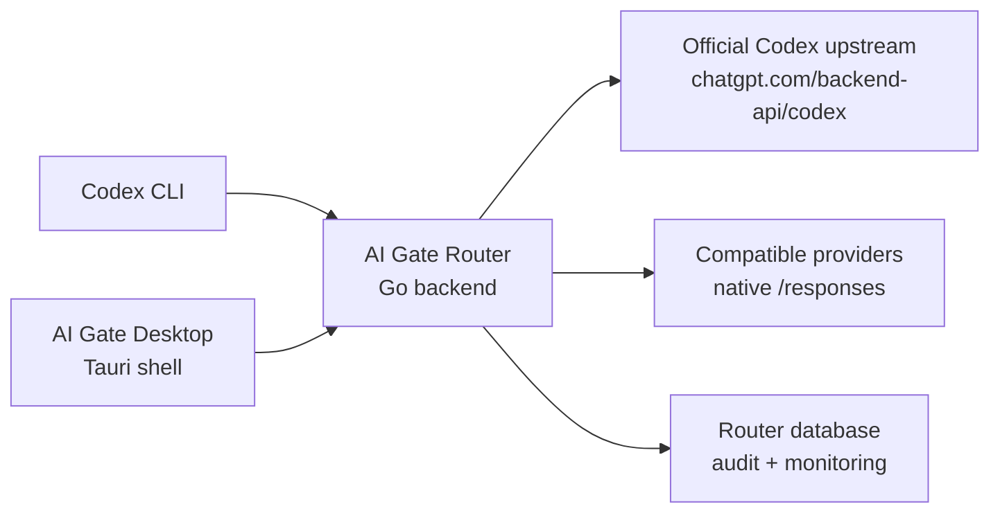
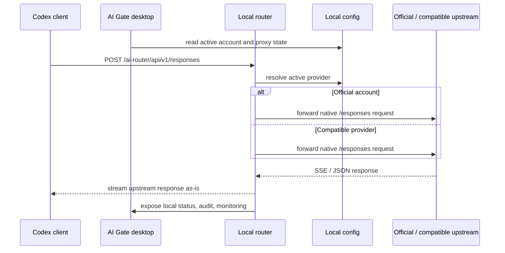

# AI Gate

[简体中文](../README.md) | English

<p align="center">
  
</p>

<p align="center">
  <strong>A local-first entry layer for Codex workflows: unify accounts, switch without breaking the session, and stop hand-editing config.</strong>
</p>

<p align="center">
  
  
  
  
  
  
</p>

AI Gate is not another model and not a hosted proxy service. It is a lightweight local gateway and desktop shell that sits above AI tooling and fixes the real operational pain: managing multiple official and third-party accounts, surviving quota exhaustion without stopping the conversation, and bringing proxy, Skill, MCP, statistics, and backups into one local entry point while account data and keys stay on your machine.

## Why AI Gate Exists

Once people start using Codex heavily, the main problem is rarely the model itself. It becomes workflow friction:

- one official account is not enough, but multiple accounts are tedious to manage
- third-party APIs help with budget, but mixing them with official accounts quickly turns config into a mess
- long-running conversations break when the active account runs out of quota or becomes unstable
- Skill, MCP, statistics, proxy control, and restore flows live in different places
- users want less setup work without giving their keys to a remote relay service

AI Gate is a local-first answer to that layer of the problem.

## Core Highlights

### 1. Unified account routing

- Manage multiple official accounts and third-party accounts together
- Keep one stable local endpoint instead of repeatedly editing client config
- Import, switch, and inspect account state from the desktop shell

### 2. Session-safe failover

- When the active account runs out of quota or becomes temporarily unavailable, AI Gate can move to the next available account
- The goal is to keep the conversation moving without forcing a manual restart
- Better suited for long tasks, sustained debugging, and heavy coding sessions

### 3. Local-first security

- The backend listens on loopback only and the desktop app launches a local sidecar only
- Account data, keys, config patches, and backup snapshots stay on your machine
- The code is open for inspection instead of asking users to trust a black box

### 4. Skill and MCP management

- Skill and MCP workflows are brought under the same desktop entry point
- Easier to connect local tools, knowledge bases, and custom workflows to Codex
- Better fit for users who rely on Obsidian, scripts, or private tool services

### 5. Observability without extra friction

- Includes proxy control, statistics, backup and restore, and tray operations
- Keeps the engineering surface visible while staying usable for non-terminal users
- The goal is not feature sprawl. It is a setup you can keep using every day

## Who It Is For

- People running multiple official accounts
- People mixing official accounts with third-party APIs
- People who do not want to keep editing `~/.codex/config.toml`
- People who want Skill, MCP, statistics, and proxy control in one desktop app
- People who care about local security boundaries and auditable code

## Product Tour

### Main dashboard


### Proxy settings


### Statistics page


### MCP management


### Skill management


## Quick Start

### End users

1. Download the desktop app from [the latest release](https://github.com/GcsSloop/ai-gate/releases/latest)
2. Import an official account or add a third-party API account
3. Enable the proxy and start using Codex
4. If the current account is exhausted, AI Gate will try to continue on the next available account

### Developers

```bash
cp .env.example .env
make backend
make frontend
npm --prefix desktop install
npm --prefix desktop run dev
```

The frontend dev server proxies the local API surface to `http://127.0.0.1:6789`.

## Architecture And Safety Boundary


```mermaid
flowchart LR
    A["Codex CLI"] --> C["AI Gate Router<br/>Go backend"]
    B["AI Gate Desktop<br/>Tauri shell"] --> C
    C --> E["Official Codex upstream<br/>chatgpt.com/backend-api/codex"]
    C --> F["Compatible providers<br/>native /responses"]
    C --> G["Router database<br/>audit + monitoring"]
```

### Request flow


```mermaid
sequenceDiagram
    participant Client as Codex client
    participant Desktop as AI Gate desktop
    participant Router as Local router
    participant Config as Local config
    participant Upstream as Official / compatible upstream

    Desktop->>Config: read active account and proxy state
    Client->>Router: POST /ai-router/api/v1/responses
    Router->>Config: resolve active provider
    alt Official account
        Router->>Upstream: forward native /responses request
    else Compatible provider
        Router->>Upstream: forward native /responses request
    end
    Upstream-->>Router: SSE / JSON response
    Router-->>Client: stream upstream response as-is
    Router->>Desktop: expose local status, audit, monitoring
```

### Boundary rules

- **Local only**: the backend binds to loopback and the desktop shell starts a local sidecar only
- **Thin gateway**: upstream remains authoritative for `response_id`, `previous_response_id`, status codes, and the SSE lifecycle
- **No protocol cosplay**: unsupported semantics are removed instead of being faked
- **Local-first state**: desktop-managed state and backup snapshots live under `~/.aigate/data`
- **Recoverable patches**: AI Gate only edits `~/.codex/config.toml` and `~/.codex/auth.json` when proxy or restore flows require it

For the precise boundary, see [thin-gateway-mode.md](thin-gateway-mode.md).

## How Codex, Skill, And MCP Fit Together

### Codex CLI

Recommended local config:

```toml
model_provider = "router"

[model_providers.router]
name = "router"
base_url = "http://127.0.0.1:6789/ai-router/api"
wire_api = "responses"
requires_openai_auth = true
```

Gateway contract:

- `POST /ai-router/api/v1/responses`
- `GET /ai-router/api/v1/models`

### Skill workflows

- AI Gate does not replace Skills. It gives them a steadier local entry point
- You can keep using repository Skills or custom Skills for migration, local scripting, or knowledge workflows
- The migration Skill lives at [skills/migrating-codex-history/SKILL.md](../skills/migrating-codex-history/SKILL.md)

### MCP workflows

- MCP configuration can be managed alongside accounts and proxy state in the desktop shell
- This is a better fit for local knowledge bases, script services, and private tool services
- Users who rely on MCP heavily usually benefit from one place to manage those connections

## What It Does

- Routes `POST /responses` and `GET /models` through a local gateway endpoint
- Supports official account auth flows and token refresh
- Supports third-party providers only when they natively implement `/responses`
- Exposes a React frontend and Tauri desktop shell for local control
- Stores local audit and monitoring data for observability
- Provides entry points for Skill, MCP, statistics, proxy control, and backup workflows

## What It Explicitly Does Not Do

- Fall back from `/responses` to `/chat/completions`
- Generate local `response_id`
- Rebuild `previous_response_id` chains from local history
- Emulate response retrieval endpoints
- Act as a public remote gateway or hosted SaaS deployment target

## Local Development

### Prepare environment

```bash
cp .env.example .env
```

Edit `.env` and replace `CODEX_ROUTER_ENCRYPTION_KEY` with a real random secret before starting the backend.

Current local defaults:

```env
CODEX_ROUTER_LISTEN_ADDR=127.0.0.1:6789
CODEX_ROUTER_DATABASE_PATH=data/codex-router.sqlite
CODEX_ROUTER_SCHEDULER_INTERVAL=5m
CODEX_ROUTER_ENCRYPTION_KEY=change-this-to-a-random-32-plus-char-secret
```

### Common commands

```bash
make backend
make frontend
make test
```

That runs:

- `cd backend && go test ./...`
- `npm --prefix frontend run test`

### Optional third-party smoke

```bash
THIRD_PARTY_BASE_URL=https://code.ppchat.vip/v1 \
THIRD_PARTY_API_KEY=sk-... \
make smoke-third-party
```

Use this only for providers that natively implement `/responses`.

## Desktop Packaging

Local macOS package flow:

```bash
npm --prefix frontend ci
npm --prefix desktop install
bash scripts/desktop/build_sidecar_macos.sh
npm --prefix desktop run tauri build -- --target universal-apple-darwin
bash scripts/desktop/notarize_macos.sh
bash scripts/desktop/collect_release_assets.sh
```

Release assets are collected in `release-assets/`:

- `aigate-<tag>-macOS.zip`
- `aigate-<tag>-darwin-universal.app.tar.gz`
