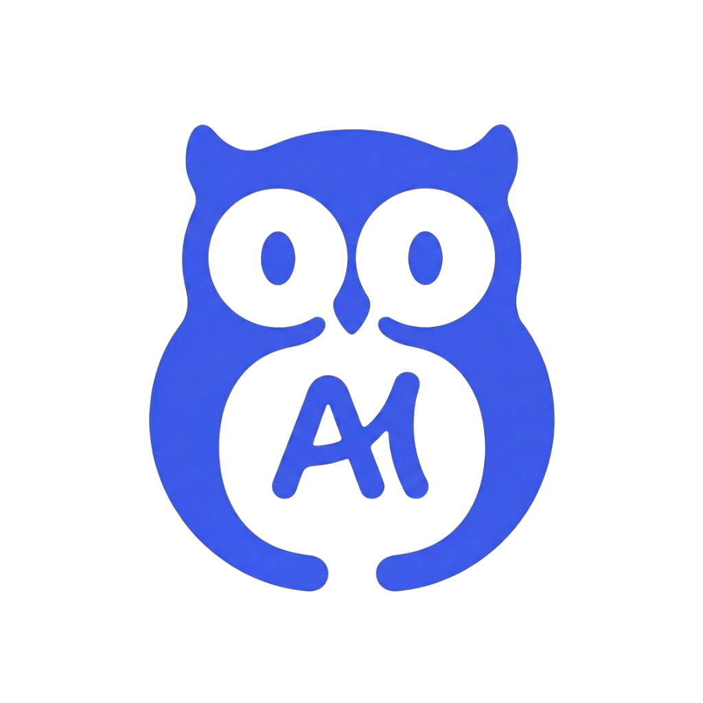
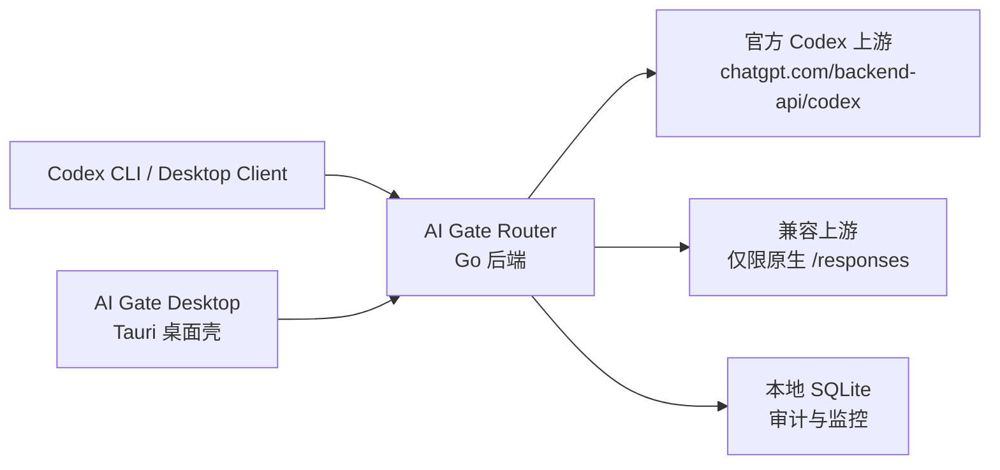
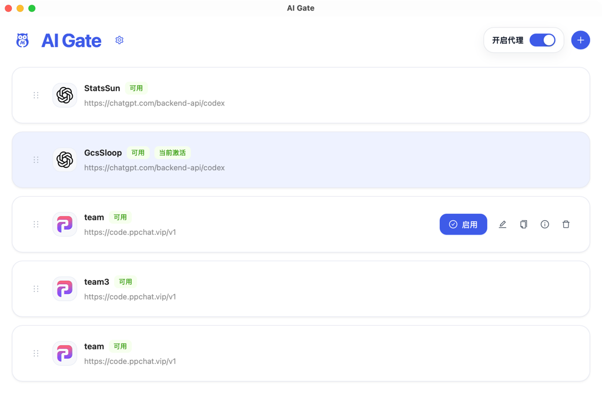
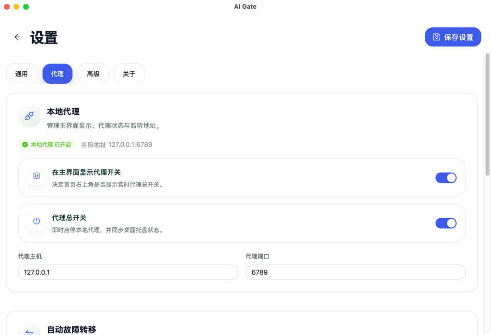

# AI Gate

[English](/Users/gcssloop/WorkSpace/AIGC/codex-router/README.md) | 简体中文

<p align="center">
  
</p>

AI Gate 是一个面向 Codex 工作流的本地优先网关与桌面外壳，核心目标非常明确：

- 在本地切换官方账号和兼容账号
- 将请求路由到原生上游 `/responses` 接口
- 保持上游响应语义，而不是在本地重造协议
- 提供轻量的本地观测、审计与桌面控制能力

这个仓库**不是**云端部署方案，也**不是**协议兼容模拟层。

## 项目定位

很多 Codex 用户真正需要的不是一个“全能代理”，而是一个稳定、可控、可观测的本地入口，用来解决几类现实问题：

- 多账号切换成本高
- 不希望频繁修改客户端配置
- 希望保留统一的本地入口和观测面板
- 希望通过桌面应用降低使用门槛

AI Gate 的做法是保持“薄网关”边界：只做认证、路由、透传和观测，不伪造对话语义，不本地拼装响应协议。

## 核心原则

- **仅本地运行**：后端只监听回环地址，桌面应用只启动本地 sidecar。
- **薄网关优先**：`response_id`、`previous_response_id`、状态码和 SSE 生命周期全部以上游为准。
- **不做伪实现**：做不到就显式删除，不用“看起来像支持”来掩盖语义缺失。
- **工程可控**：账号切换、运行审计、监控摘要都保留在本地。

## 架构概览



## 界面预览

### 首页总览



### 代理配置页



## 当前能力

- 通过本地网关暴露 `POST /responses` 与 `GET /models`
- 支持官方账号认证与 token 刷新
- 支持原生实现 `/responses` 的第三方提供方
- 提供 React 前端与 Tauri 桌面外壳
- 保留本地审计数据与运行观测数据

## 明确不支持的能力

- 从 `/responses` 回退到 `/chat/completions`
- 在本地生成 `response_id`
- 用本地历史重建 `previous_response_id`
- 模拟响应检索类接口
- 作为公网托管网关或 SaaS 服务直接部署

更完整的边界说明见 [thin-gateway-mode.md](/Users/gcssloop/WorkSpace/AIGC/codex-router/docs/thin-gateway-mode.md)。

## 快速开始

### 1. 准备环境变量

```bash
cp .env.example .env
```

修改 `.env`，至少替换 `CODEX_ROUTER_ENCRYPTION_KEY`，不要继续使用示例值。

默认本地配置如下：

```env
CODEX_ROUTER_LISTEN_ADDR=127.0.0.1:6789
CODEX_ROUTER_DATABASE_PATH=data/codex-router.sqlite
CODEX_ROUTER_SCHEDULER_INTERVAL=5m
CODEX_ROUTER_ENCRYPTION_KEY=change-this-to-a-random-32-plus-char-secret
```

### 2. 启动后端

```bash
make backend
```

### 3. 启动前端

```bash
make frontend
```

前端开发服务器会将本地 API 请求代理到 `http://127.0.0.1:6789`。

### 4. 启动桌面壳

```bash
npm --prefix desktop install
npm --prefix desktop run dev
```

## 与 Codex CLI 配合使用

推荐本地配置如下：

```toml
model_provider = "router"

[model_providers.router]
name = "router"
base_url = "http://127.0.0.1:6789/ai-router/api"
wire_api = "responses"
requires_openai_auth = true
```

当前网关协议面：

- `POST /ai-router/api/v1/responses`
- `GET /ai-router/api/v1/models`

关键说明：

- 官方账号默认转发到 `https://chatgpt.com/backend-api/codex`
- 第三方账号必须原生支持 `/responses`
- `response_id` 以上游返回为准
- 本地不会伪造依赖响应状态重建的检索/续写语义

代理开关行为：

- 为默认 Codex provider 开启代理时，会临时写入 `[model_providers.aigate]`，并将 `model_provider` 切到 `aigate`
- 默认官方模式关闭代理时，会删除临时的 `aigate` provider 配置，并删除顶层 `model_provider` 字段，让 Codex 回到默认 provider 行为
- 如果开启代理时是对现有第三方 provider 做 `base_url` 补丁，关闭时会恢复原始 provider 名称和 `base_url`，不会覆盖其它独立配置修改

## 会话迁移 Skill

获取 skill 的链接：

- [GitHub skill 链接](https://github.com/GcsSloop/ai-gate/blob/main/skills/migrating-codex-history/SKILL.md)

使用方式：

1. 打开上面的链接，把完整 skill 文本复制到 Codex 对话里。
2. 对 Codex 说：`使用这个 skill，把我 ~/.codex 里 openai 的会话迁移到 aigate，先 dry-run 并把 summary 给我确认，确认后再正式执行。` 如果本地有这个仓库，skill 会直接用本地脚本；如果没有，skill 会从 `main` 分支的 raw 地址拉取脚本。
3. 如果用户在 Windows 上使用，skill 会要求 Codex 先把 `.sh` 的逻辑转换成等价的 PowerShell 或原生 Windows 步骤，再执行迁移。

这个流程在仓库里的单一事实来源是 [skills/migrating-codex-history/SKILL.md](../skills/migrating-codex-history/SKILL.md)。

## 本地开发

### 后端

```bash
make backend
```

### 前端

```bash
make frontend
```

### 测试

```bash
make test
```

当前会执行：

- `cd backend && go test ./...`
- `npm --prefix frontend run test`

### 可选第三方冒烟测试

```bash
THIRD_PARTY_BASE_URL=https://code.ppchat.vip/v1 \
THIRD_PARTY_API_KEY=sk-... \
make smoke-third-party
```

这个测试只适用于原生支持 `/responses` 的上游。

## 桌面打包

本地 macOS 打包流程：

```bash
npm --prefix frontend ci
npm --prefix desktop install
bash scripts/desktop/build_sidecar_macos.sh
npm --prefix desktop run tauri build -- --target universal-apple-darwin
bash scripts/desktop/notarize_macos.sh
bash scripts/desktop/collect_release_assets.sh
```

产物会出现在 `release-assets/`：

- `aigate-<tag>-macOS.dmg`
- `aigate-<tag>-macOS.zip`
- `aigate-<tag>-darwin-universal.app.tar.gz`
- `aigate-<tag>-darwin-universal.app.tar.gz.sig`
- `aigate-<tag>-<platform>-SHA256SUMS.txt`

GitHub Releases 更新还依赖 updater 签名密钥：

- `TAURI_SIGNING_PRIVATE_KEY`
- 可选 `TAURI_SIGNING_PRIVATE_KEY_PASSWORD`

Tag 发布时，除了手动安装包，还会额外上传：

- `aigate-<tag>-windows.msi.sig`
- `latest.json`

`latest.json` 会在 release workflow 中生成，并作为桌面端检查更新的数据源。

## 仓库结构

```text
backend/              Go 路由后端
frontend/             React + Vite Web UI
desktop/              Tauri 桌面壳
docs/                 设计文档与操作说明
scripts/              打包、迁移、冒烟测试脚本
references/           上游源码参考与逆向分析材料
```

## 相关文档

- [thin-gateway-mode.md](/Users/gcssloop/WorkSpace/AIGC/codex-router/docs/thin-gateway-mode.md) - 薄网关模式边界
- [testing.md](/Users/gcssloop/WorkSpace/AIGC/codex-router/docs/testing.md) - 测试与验证流程

## 仅本地运行策略

AI Gate 明确是本地优先产品：

- 后端监听地址限制在 loopback
- 桌面包只启动本地 sidecar
- 当前仓库不提供云端部署产物

如果你需要公网托管网关，那是另一类产品，不应该从这个仓库的现状里“顺手推导”出来。
