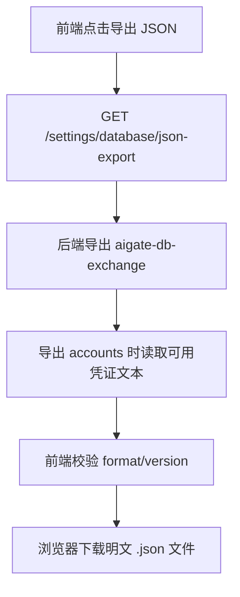
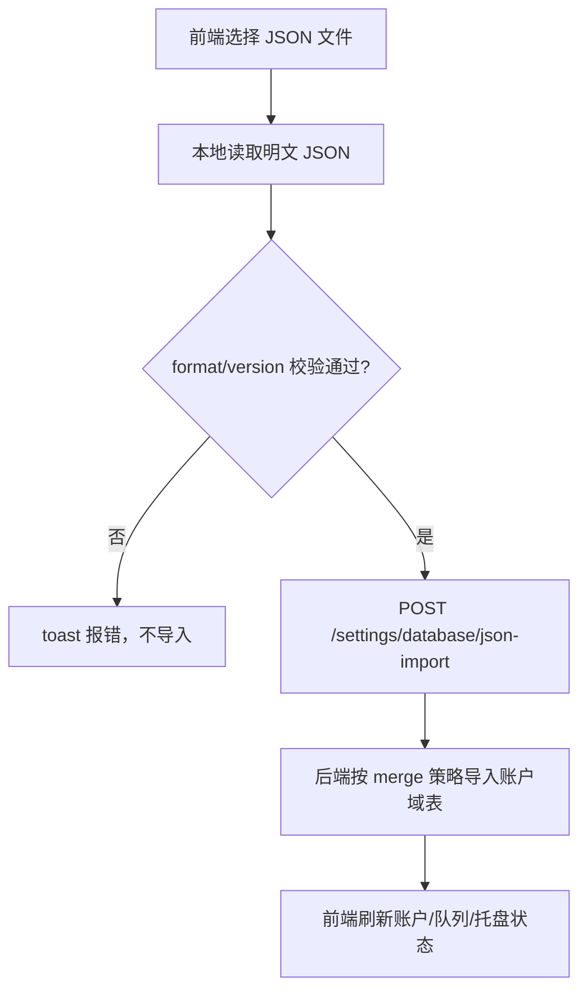

# 账户导入导出流程说明（明文文件版）

本文档描述当前实现（2026-03-10）下，账户导入导出的完整链路。

## 1. 关键结论

- 导出文件：**明文 JSON**（不再做文件级密码加密）。
- 导入文件：**明文 JSON**，前端仅做格式校验，不再要求输入密码。
- 数据范围：仅账户域数据表：
  - `accounts`
  - `account_usage_snapshots`
  - `failover_queue_items`
- 合并策略：导入为 merge 模式，不覆盖原有账户；同名账户会并存。

## 2. 当前主键与是否会覆盖

- `accounts` 主键：`id INTEGER PRIMARY KEY AUTOINCREMENT`。
- 导入时不会带入源 `id` 覆盖目标 `id`，而是插入新行生成新 `id`。
- 因此“同名账户导入后被主键覆盖”不是设计上的预期行为。

## 3. 导出流程（明文 JSON）

说明：
- 后端导出时会优先输出“可迁移凭证文本”（避免导出无法迁移的旧密文）。

## 4. 导入流程（明文 JSON）

## 5. 入库加密（与文件是否加密分离）

虽然文件导入导出为明文，但数据库内 `credential_ref` 的静态存储仍按后端配置决定：

- 若配置了 `CODEX_ROUTER_ENCRYPTION_KEY`：
  - 导入时会对 `credential_ref` 重新加密后再入库。
- 若未配置：
  - 以明文形式存储（功能可用，但静态安全性较低）。

## 6. 导入合并细节

1. `accounts`
- 逐行插入，不删除已有数据。
- 同名账户保留多条记录。

2. `account_usage_snapshots`
- 通过“源账号 ID -> 新账号 ID”映射重写 `account_id` 后插入。

3. `failover_queue_items`
- 通过映射重写 `account_id` 并追加到现有队列尾部。

4. Schema 兼容
- 以源/目标公共列交集导入，额外旧字段自动忽略。

## 7. 相关代码位置

- 前端导入导出：
  - `frontend/src/features/settings/SettingsPage.tsx`
  - `frontend/src/lib/api.ts`
- 后端导入导出：
  - `backend/internal/settings/sql_transfer.go`
  - `backend/internal/api/settings_handler.go`
  - `backend/internal/bootstrap/bootstrap.go`
