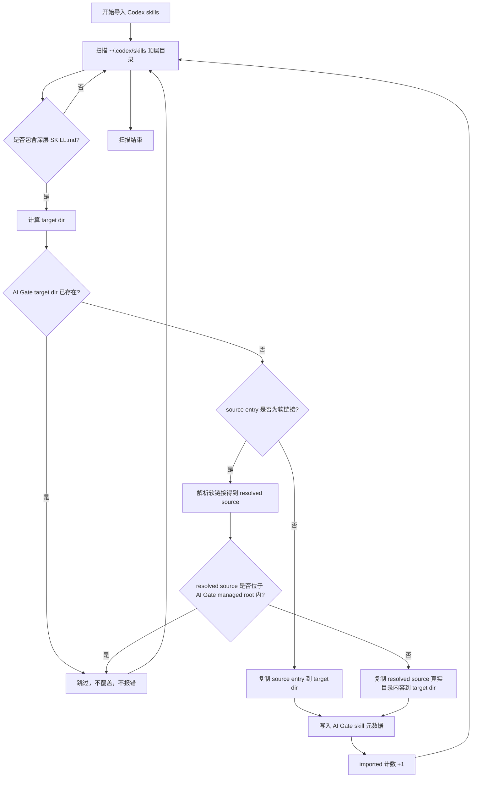

# Skill 导入与软链接处理流程

本文档定义从 Codex 扫描并导入 skill 集合到 AI Gate 托管目录时的目标行为，重点约束软链接场景，避免覆盖已托管 skill 或因 `file exists` 导致导入失败。

## 目标

- 普通 skill 目录按当前规则导入到 AI Gate 托管目录。
- 如果扫描到的是软链接，且软链接最终指向 AI Gate 托管目录，则跳过导入。
- 如果扫描到的是软链接，但最终指向的不是 AI Gate 托管目录，则复制软链接解析后的真实目录内容到 AI Gate 托管目录，作为文件备份导入。
- 如果 AI Gate 托管目录里已经存在同名 skill，则默认跳过，不覆盖已有内容。

## 术语

- `source entry`：从 `~/.codex/skills` 扫描到的顶层 skill 集合目录。
- `managed root`：AI Gate 托管 skill 根目录，即 `~/.aigate/data/tooling/skills`。
- `target dir`：当前 `source entry` 对应的 AI Gate 托管目标目录。
- `resolved source`：对 `source entry` 执行 `EvalSymlinks` 后得到的真实目录。

## 处理规则

1. 先枚举 Codex skill 顶层目录，只处理包含任意深层 `SKILL.md` 的集合目录。
2. 对每个集合目录计算其对应的 `target dir`。
3. 如果 `target dir` 已存在，则直接跳过。
4. 如果 `source entry` 不是软链接，则直接复制目录内容到 `target dir`。
5. 如果 `source entry` 是软链接，则解析出 `resolved source`。
6. 如果 `resolved source` 位于 AI Gate 的 `managed root` 之内，则跳过。
7. 如果 `resolved source` 不在 AI Gate 的 `managed root` 之内，则复制 `resolved source` 的真实目录内容到 `target dir`。
8. 只有真正完成复制到 `target dir` 的条目才计入 `imported`。

## Mermaid 流程图

## 示例

### 示例 1：普通目录

- Codex 中存在 `~/.codex/skills/Humanizer-zh/`
- AI Gate 中不存在 `~/.aigate/data/tooling/skills/Humanizer-zh/`
- 结果：直接复制导入，`imported += 1`

### 示例 2：Codex 目录是指向 AI Gate 的软链接

- Codex 中 `~/.codex/skills/Humanizer-zh -> ~/.aigate/data/tooling/skills/Humanizer-zh`
- 结果：跳过，不复制，不覆盖，不报错

### 示例 3：Codex 目录是指向第三方目录的软链接

- Codex 中 `~/.codex/skills/Humanizer-zh -> /external/skills/Humanizer-zh`
- AI Gate 中不存在同名托管目录
- 结果：复制 `/external/skills/Humanizer-zh` 的真实目录内容到 `~/.aigate/data/tooling/skills/Humanizer-zh/`

### 示例 4：AI Gate 中已存在同名托管目录

- AI Gate 中已存在 `~/.aigate/data/tooling/skills/Humanizer-zh/`
- 无论 Codex 扫描到的是普通目录还是软链接
- 结果：直接跳过，不覆盖已有内容
